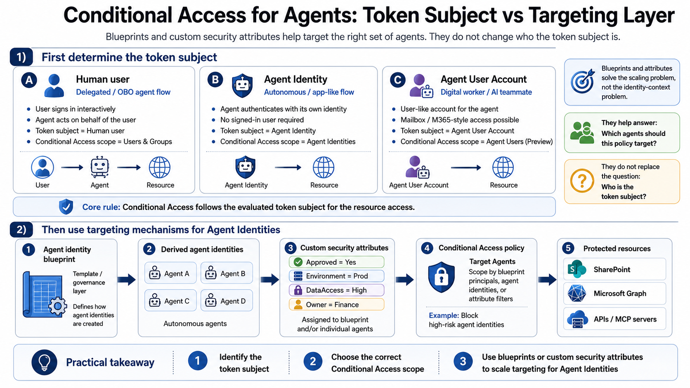
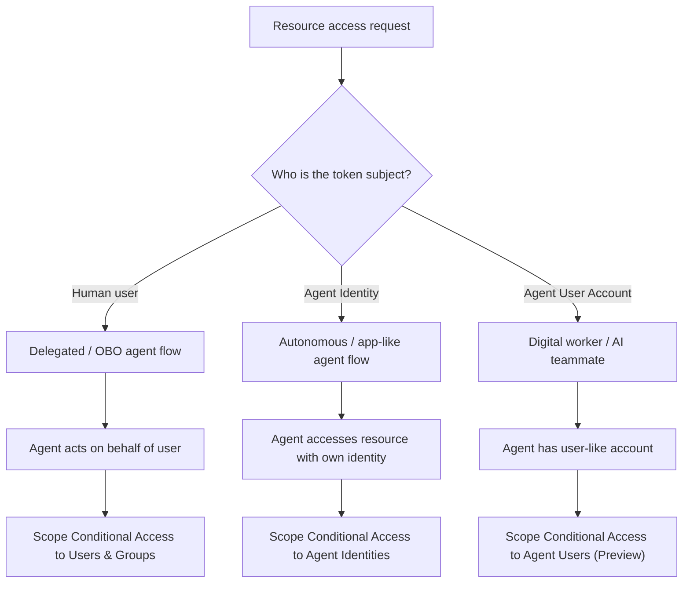

# Microsoft-Entra-Agent-Identity-Conditional-Access-Explained

## Why this repository exists
This repository explains how Microsoft Entra Conditional Access applies to Agent Identities, Agent Users, and delegated On-Behalf-Of agent flows.

Microsoft Learn explains the technical details in depth, but the topic can be hard to translate into a simple mental model for meetings, design reviews, and remediation planning.

This repository provides a pragmatic entry point to understand how Microsoft Entra Conditional Access applies to Human Users, Agent Identities, Agent Users, and delegated On-Behalf-Of agent flows.

It does not replace Microsoft Learn. Sequence diagrams and detailed authentication flows are still worth learning, especially in security engineering.

## Summary 




```
Agent Identity is both an Entra object and a Conditional Access assignment type.
The important security question is not whether an Agent Identity exists in the flow,
but whether it is the evaluated subject for the resource access.
```

## Decision Model



## Why Microsoft makes this distinction

Microsoft separates these identity types because the authentication and authorization flows are different.

### 1. Human user as token subject
In a delegated / OBO flow, the user signs in interactively first.  
The agent then acts on behalf of that user when requesting access to downstream resources.

- Token subject = Human user
- Agent Identity = actor / calling agent in the flow
- Relevant Conditional Access scope = **Users & Groups**

### 2. Agent Identity as token subject
In an autonomous or app-like flow, the agent authenticates with its own identity and no signed-in user is required.

- Token subject = Agent Identity
- Relevant Conditional Access scope = **Agent Identities**

### 3. Agent User Account as token subject
In a digital worker / AI teammate model, the agent can have a user-like account and directly access user-oriented services.

- Token subject = Agent User Account
- Relevant Conditional Access scope = **Agent Users (Preview)**

So the distinction is not cosmetic.  
It exists because the evaluated identity for resource access changes depending on the flow.

---

## Where blueprints and custom security attributes fit

Blueprints and custom security attributes are important, but they do **not** replace token-subject analysis.

They help answer:

> Which agents should this policy target?

They do **not** replace the question:

> Who is the evaluated token subject?

### Agent identity blueprints
Agent identity blueprints are a governance and creation layer for agent identities.

They help organizations:
- standardize how agent identities are created
- apply consistent policy logic
- manage large numbers of agents more efficiently

### Custom security attributes / attribute-driven Conditional Access
Custom security attributes help target agent identities dynamically, for example by tagging them with values such as:

- `Approved = Yes`
- `Environment = Prod`
- `Owner = Finance`
- `DataAccess = High`

This helps scale Conditional Access targeting for autonomous agents.

### Important takeaway
Blueprints and attributes solve the **scaling / targeting** problem.

They do **not** solve or bypass the **identity-context** problem.

A good mental model is:

1. Identify the token subject  
2. Choose the correct Conditional Access scope  
3. Use blueprints or custom security attributes to scale targeting for Agent Identities  

---

## Practical interpretation

### If the token subject is a human user
Use **user-based Conditional Access**.

Example:
- User signs in
- User instructs agent to access Resource X
- Agent uses delegated permissions / OBO
- Conditional Access applies to the **user**

### If the token subject is an Agent Identity
Use **Conditional Access for Agent Identities**.

Example:
- Autonomous agent authenticates with its own identity
- Agent accesses Microsoft Graph, SharePoint, API, or MCP server
- Conditional Access applies to the **agent identity**

### If the token subject is an Agent User Account
Use **Conditional Access for Agent Users (Preview)**.

Example:
- AI teammate / digital worker has a user-like account
- Access is evaluated against that **agent user account**

---

## Example: blocking High-Risk Agent Identities

Blocking High-Risk Agent Identities is a useful control.

But it only applies when the **Agent Identity itself** is the evaluated subject for the resource access.

Typical setup:

1. Create a new Conditional Access policy
2. Scope it to **Agents**
3. Include **All agent identities**
4. Target **All resources**
5. Set **Agent risk = High**
6. Grant control: **Block access**
7. Start with **Report-only**
8. Review logs and enforce once validated


## SOURCES:
- https://learn.microsoft.com/en-us/entra/identity/conditional-access/agent-id?utm_source=chatgpt.com
- https://learn.microsoft.com/en-us/entra/identity/conditional-access/policy-autonomous-agents?tabs=use-custom-security-attributes
- https://learn.microsoft.com/en-us/entra/agent-id/agent-autonomous-app-oauth-flow
- https://learn.microsoft.com/en-us/entra/agent-id/what-are-agent-identities?utm_source=chatgpt.com
- https://learn.microsoft.com/en-us/entra/identity/conditional-access/policy-autonomous-agents?utm_source=chatgpt.com&tabs=use-custom-security-attributes
