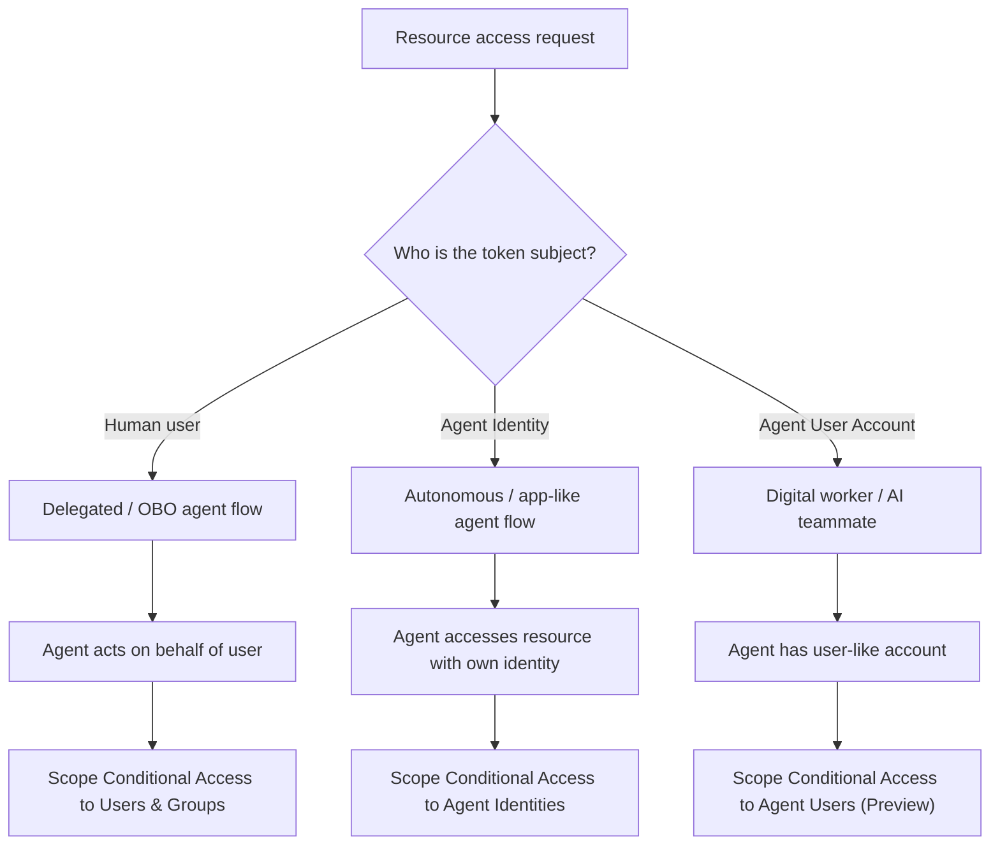

# Microsoft-Entra-Agent-Identity-Conditional-Access-Explained

```md

```

This repository explains how Microsoft Entra Conditional Access applies to Agent Identities, Agent Users, and delegated On-Behalf-Of agent flows.

```
Agent Identity is both an Entra object and a Conditional Access assignment type.
The important security question is not whether an Agent Identity exists in the flow,
but whether it is the evaluated subject for the resource access.
```





## SOURCES:
- https://learn.microsoft.com/en-us/entra/identity/conditional-access/agent-id?utm_source=chatgpt.com
- https://learn.microsoft.com/en-us/entra/identity/conditional-access/policy-autonomous-agents?tabs=use-custom-security-attributes
- https://learn.microsoft.com/en-us/entra/agent-id/agent-autonomous-app-oauth-flow
- https://learn.microsoft.com/en-us/entra/agent-id/what-are-agent-identities?utm_source=chatgpt.com
- https://learn.microsoft.com/en-us/entra/identity/conditional-access/policy-autonomous-agents?utm_source=chatgpt.com&tabs=use-custom-security-attributes
